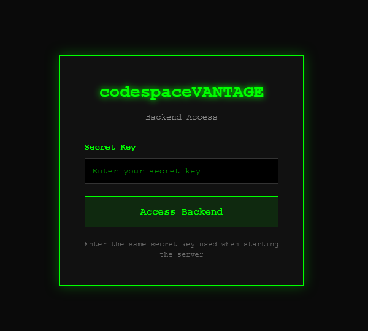
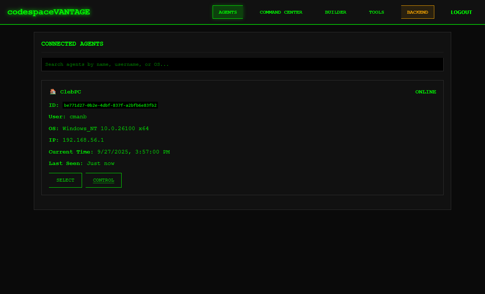
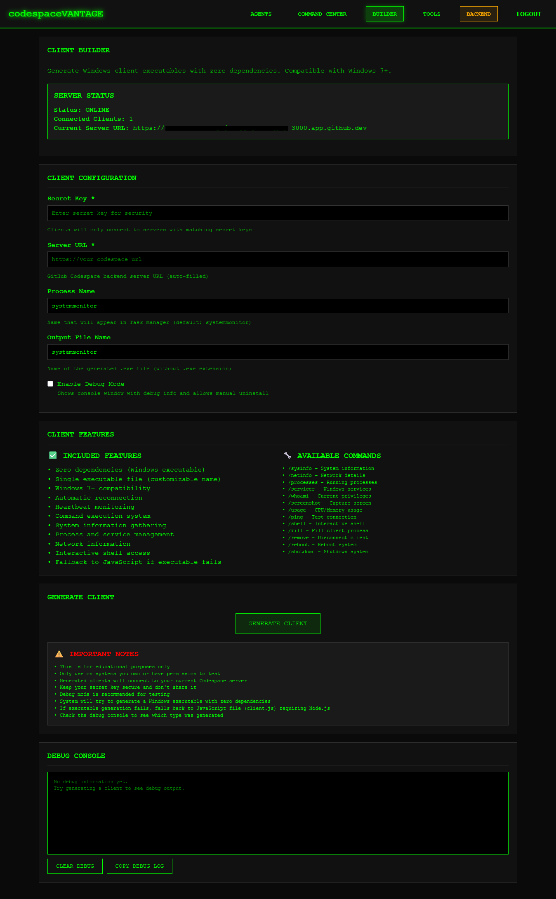
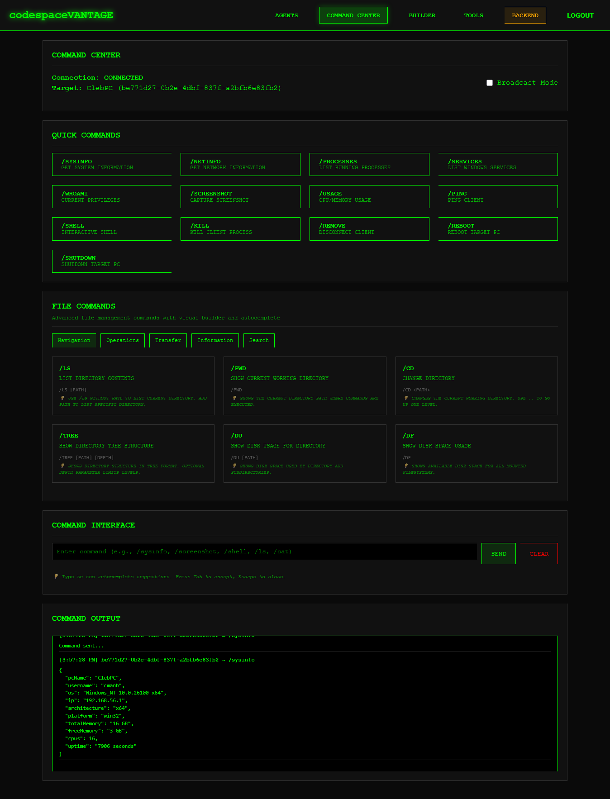
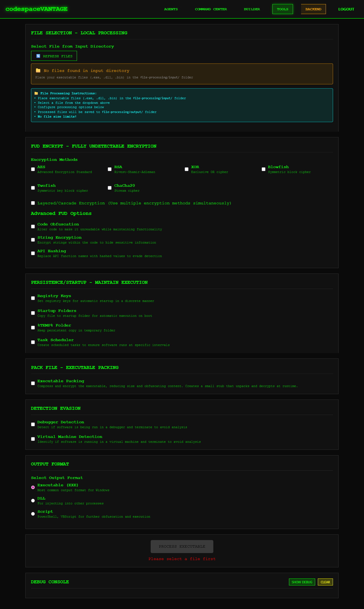
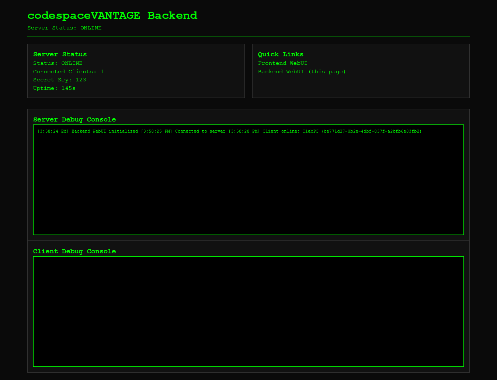

# codespaceVANTAGE (codespace Virtual Administration & Network Tool for Access, Governance, and Execution)

## _The Ultimate Cloud-Native Command & Control Framework_

---

## 🚀 **Revolutionary Cloud-Native Architecture**

**codespaceVANTAGE** represents a paradigm shift in command and control frameworks. Unlike traditional C2 platforms that require complex server setup, port forwarding, and infrastructure management, codespaceVANTAGE leverages the power of **GitHub Codespaces** to deliver a fully cloud-hosted, zero-configuration solution.

### ✨ **Why codespaceVANTAGE is Unique**

- **🌐 Zero Server Setup**: Runs entirely in GitHub Codespaces - no local servers, no port forwarding, no infrastructure management
- **⚡ Instant Deployment**: One-click Codespace creation gets you a fully functional C2 platform in seconds
- **🔒 Enterprise Security**: Built-in authentication, encrypted communications, and secure client management
- **🎨 Modern Web Interface**: Beautiful, responsive React-based dashboard with real-time updates
- **🛠️ Advanced File Management**: Comprehensive file operations with visual command builder and autocomplete
- **📱 Cross-Platform**: Works on any device with a web browser - no software installation required

---

## 🎯 **Core Features**

### **🔐 Secure Authentication System**

- **Multi-layer authentication** with secret key protection
- **Session management** with automatic timeout
- **Role-based access control** for different user levels
- **Audit logging** for all authentication events

### **👥 Agent Management Dashboard**

- **Real-time agent monitoring** with live status updates
- **Geographic location tracking** with IP geolocation
- **System information display** including OS, hardware, and network details
- **Agent health monitoring** with heartbeat detection
- **Bulk operations** for managing multiple agents simultaneously
- **Advanced filtering and search** capabilities

### **🏗️ Advanced Client Builder**

- **Zero-dependency executable generation** for Windows systems
- **Customizable client configuration** including process names and server URLs
- **Multiple output formats** (EXE, DLL, PowerShell scripts)
- **Built-in obfuscation and encryption** options
- **Debug mode support** for development and testing
- **Automatic client updates** and version management

### **💻 Command Center**

- **Real-time command execution** with live output streaming
- **Broadcast capabilities** for sending commands to multiple agents
- **Command history** with full audit trail
- **Quick command shortcuts** for common operations
- **Advanced file management system** with visual command builder
- **Autocomplete and command suggestions** for improved efficiency

#### **🗂️ Advanced File Management System**

The Command Center features a revolutionary file management system with:

- **📁 Navigation Commands**: `/ls`, `/pwd`, `/cd`, `/tree`, `/du`, `/df`
- **⚙️ File Operations**: `/cat`, `/head`, `/tail`, `/cp`, `/mv`, `/rm`, `/mkdir`, `/touch`
- **📤 Transfer Commands**: `/download`, `/upload`, `/wget`, `/curl`
- **ℹ️ Information Tools**: `/stat`, `/file`, `/md5`, `/sha256`, `/env`, `/which`
- **🔍 Search & Archive**: `/grep`, `/find`, `/zip`, `/unzip`, `/strings`, `/hexdump`

**Visual Command Builder Features:**

- **Interactive parameter input** with validation
- **Real-time command preview** showing exactly what will be executed
- **Usage examples and helpful tips** for each command
- **Category-based organization** for easy command discovery
- **Advanced autocomplete system** with intelligent suggestions

### **🛠️ Professional Tools Suite**

- **File Processing Engine** with support for multiple formats
- **Encryption and Obfuscation Tools** including XOR encryption, string encryption, and code obfuscation
- **Anti-Analysis Features** with debugger detection and VM detection
- **File Packing and Compression** with multiple algorithms
- **API Hashing and String Obfuscation** for advanced stealth
- **Batch Processing** for handling multiple files simultaneously
- **Custom Tool Integration** for specialized requirements

### **🖥️ Backend Management Console**

- **Real-time server monitoring** with performance metrics
- **Client connection tracking** with detailed statistics
- **Command execution logging** with full audit trails
- **System resource monitoring** including CPU, memory, and network usage
- **Debug console** for troubleshooting and development
- **Configuration management** for server settings and security policies

---

## 🏗️ **Technical Architecture**

### **Frontend (React 18)**

- **Modern React architecture** with hooks and functional components
- **Real-time WebSocket communication** for live updates
- **Responsive design** that works on desktop, tablet, and mobile
- **Dark theme interface** optimized for extended use
- **Component-based architecture** for maintainability and extensibility

### **Backend (Node.js)**

- **Express.js server** with RESTful API endpoints
- **Socket.IO integration** for real-time bidirectional communication
- **File processing engine** with support for multiple formats
- **Client management system** with persistent storage
- **Security middleware** for authentication and authorization

### **Client Architecture**

- **Zero-dependency design** for maximum compatibility
- **HTTP and WebSocket communication** with automatic fallback
- **Persistence mechanisms** for reliable operation
- **Anti-detection features** for stealth operation
- **Cross-platform compatibility** with Windows focus

---

## 🔒 **Security Features**

### **Communication Security**

- **End-to-end encryption** for all client-server communications
- **Secure WebSocket connections** with TLS/SSL
- **Authentication tokens** with automatic rotation
- **Session management** with configurable timeouts

### **Client Security**

- **Anti-debugging protection** with multiple detection methods
- **VM detection** to prevent analysis in virtual environments
- **Process name randomization** for stealth operation
- **Memory protection** against dumping and analysis

### **Server Security**

- **Secret key authentication** for client connections
- **Rate limiting** to prevent abuse
- **Input validation** and sanitization
- **Audit logging** for compliance and monitoring

---

## 🌟 **Advanced Capabilities**

### **Real-Time Monitoring**

- **Live agent status updates** with heartbeat monitoring
- **Geographic tracking** with IP geolocation services
- **System resource monitoring** including CPU, memory, and disk usage
- **Network activity tracking** with connection statistics

### **Command Execution**

- **Interactive shell access** with full command support
- **File system operations** with comprehensive file management
- **Process management** including start, stop, and monitoring
- **System information gathering** with detailed hardware and software details

### **File Management**

- **Advanced file operations** with support for all major file types
- **Transfer capabilities** including upload, download, and remote execution
- **Archive and compression** with multiple format support
- **Search and analysis** tools for file content examination

### **Automation Features**

- **Scheduled command execution** with cron-like functionality
- **Batch operations** for managing multiple agents
- **Script execution** with support for multiple scripting languages
- **Automated reporting** with customizable output formats

---

## 🎨 **User Experience**

### **Modern Interface Design**

- **Intuitive navigation** with clear visual hierarchy
- **Responsive layout** that adapts to any screen size
- **Dark theme** optimized for extended use
- **Real-time updates** with smooth animations and transitions

### **Accessibility Features**

- **Keyboard navigation** support for all functions
- **Screen reader compatibility** for accessibility compliance
- **High contrast mode** for better visibility
- **Customizable interface** with user preferences

### **Performance Optimization**

- **Lazy loading** for improved performance
- **Efficient data structures** for handling large datasets
- **Optimized rendering** with React best practices
- **Caching mechanisms** for faster response times

---

## 🚀 **Getting Started**

### **Instant Deployment**

1. **Click "Code" → "Codespaces" → "Create codespace on main"**
2. **Wait for automatic setup** (dependencies, build, configuration)
3. **Access the WebUI** at the provided URL
4. **Configure your secret key** for client authentication
5. **Start managing agents** immediately

### **No Configuration Required**

- **Automatic dependency installation**
- **Pre-configured environment**
- **Built-in security settings**
- **Ready-to-use interface**

---

## 📊 **Use Cases**

### **Educational Purposes**

- **Cybersecurity training** and education
- **Penetration testing** practice and learning
- **System administration** training
- **Network security** education

### **Research and Development**

- **Security research** and analysis
- **Tool development** and testing
- **Protocol analysis** and reverse engineering
- **Automation research** and implementation

### **Professional Testing**

- **Authorized penetration testing** on owned systems
- **Security assessment** and vulnerability testing
- **Compliance testing** and validation
- **Red team exercises** and training

---

## ⚖️ **Legal and Ethical Notice**

**codespaceVANTAGE is designed exclusively for educational and authorized testing purposes.**

### **Important Disclaimers**

- **Only use on systems you own** or have explicit written permission to test
- **Comply with all applicable laws** and regulations in your jurisdiction
- **Respect privacy and data protection** requirements
- **Use responsibly** and ethically in all scenarios

### **Intended Use Cases**

- ✅ **Educational cybersecurity training**
- ✅ **Authorized penetration testing**
- ✅ **Security research and development**
- ✅ **System administration learning**
- ❌ **Unauthorized access to systems**
- ❌ **Malicious activities or attacks**
- ❌ **Privacy violations or data theft**

---

## 🔮 **Future Roadmap**

### **Planned Enhancements**

- **Mobile client applications** for iOS and Android
- **Advanced reporting and analytics** with customizable dashboards
- **Integration with popular security tools** and frameworks
- **Cloud storage integration** for file management
- **Advanced automation** with workflow management
- **Multi-tenant support** for enterprise deployments

### **Community Features**

- **Plugin system** for custom tool integration
- **Community marketplace** for shared tools and scripts
- **Collaborative features** for team-based operations
- **Documentation and tutorials** for advanced usage

---

## 📞 **Support and Community**

### **Documentation**

- **Comprehensive user guides** for all features
- **API documentation** for developers
- **Video tutorials** for common tasks
- **FAQ section** for quick answers

### **Community Support**

- **GitHub Discussions** for questions and support
- **Issue tracking** for bug reports and feature requests
- **Community forums** for sharing knowledge
- **Regular updates** and security patches

---

## 🏆 **Why Choose codespaceVANTAGE?**

### **Revolutionary Approach**

- **First C2 framework** designed specifically for GitHub Codespaces
- **Zero infrastructure** requirements - everything runs in the cloud
- **Instant deployment** - from repository to operational in seconds
- **No technical barriers** - accessible to users of all skill levels

### **Professional Grade**

- **Enterprise-level security** with multiple protection layers
- **Scalable architecture** that grows with your needs
- **Modern technology stack** with React, Node.js, and WebSockets
- **Comprehensive feature set** covering all aspects of agent management

### **Educational Focus**

- **Perfect for learning** cybersecurity concepts and techniques
- **Safe environment** for experimentation and practice
- **Comprehensive documentation** and learning resources
- **Community support** for questions and collaboration

---

**codespaceVANTAGE** - _Where cloud-native meets command and control. Experience the future of cybersecurity frameworks today._

---

_Built with ❤️ for the cybersecurity community. Always use responsibly and ethically._
